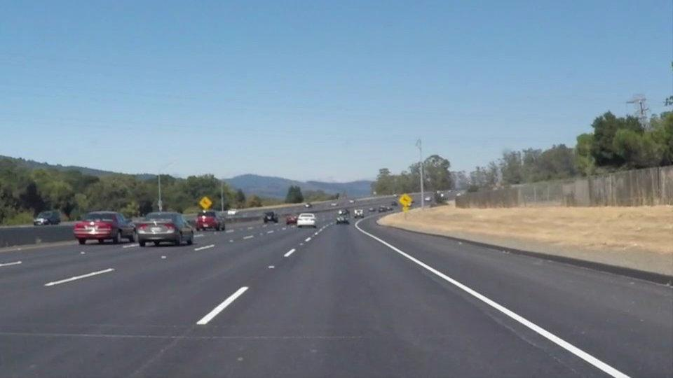
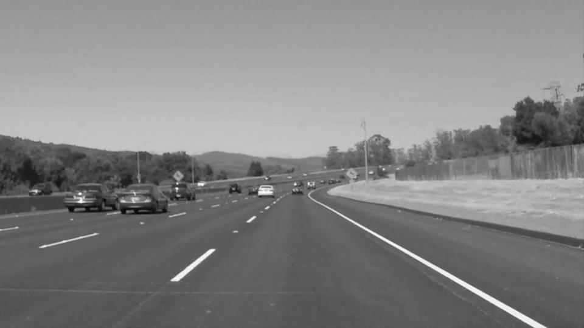
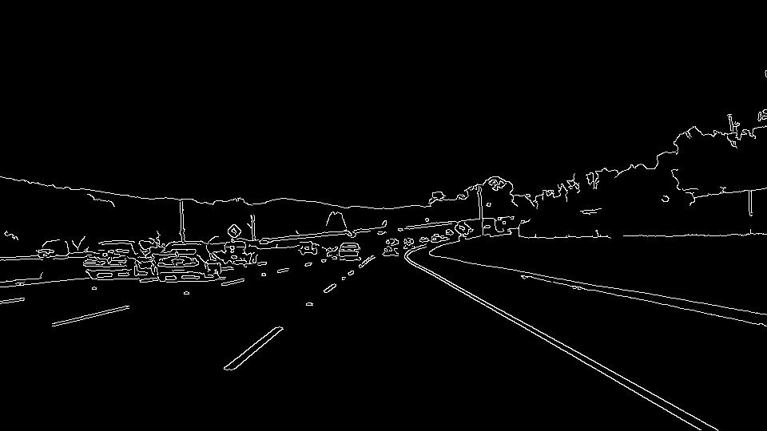
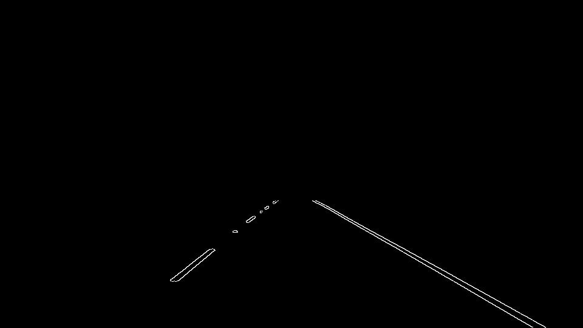
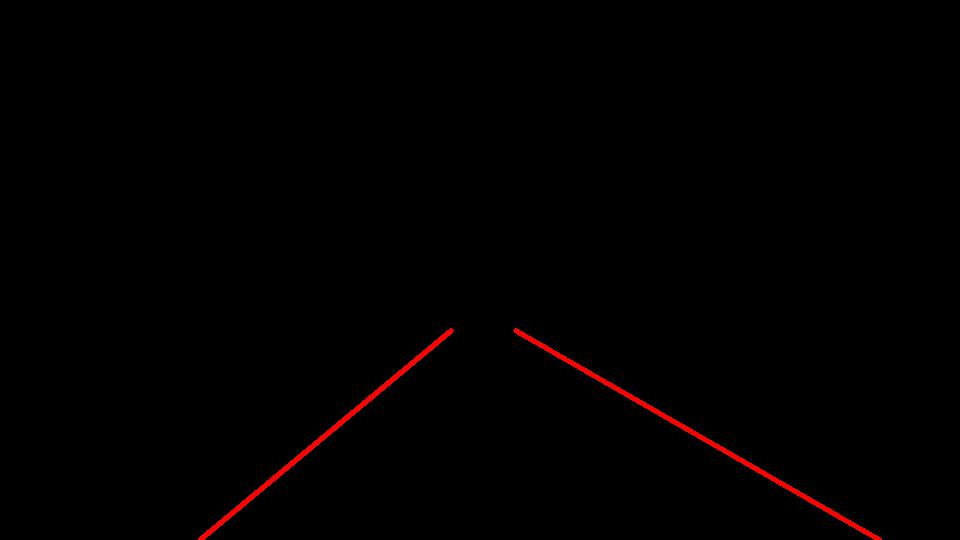
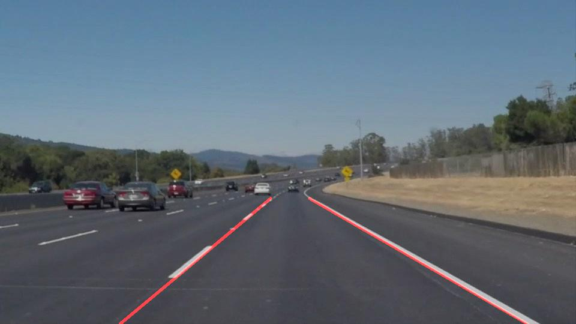
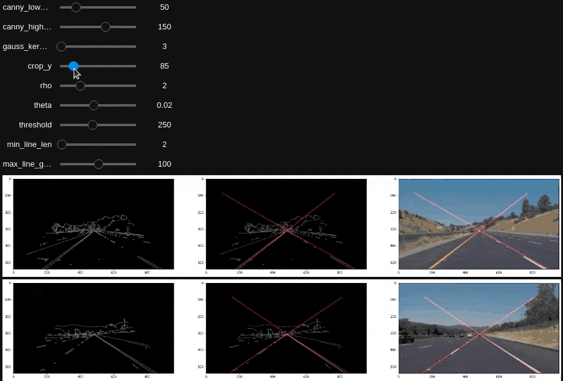

# **Finding Lane Lines on the Road** 

The goal of this project is to create a computer vision pipeline that finds lane lines on the road.

## Reflection

### Pipeline description and `draw_lines()` changes

My pipeline consists of 6 steps, all called from the `process()` function.

Given the original image:

1. 

Convert to grayscale

1. 

Apply Gaussian blur

1. 

Run Canny edge detection

1. 

Apply a mask to the region of interest: the bottom-center of the screen

1. 

Draw Hough lines onto a new image

1. 

Combine the Hough lines image with the original image (`weighted_img()`)

---

To find good parameters for the above steps, I used [ipywidgets](https://ipywidgets.readthedocs.io/en/stable/examples/Using%20Interact.html) to easily create a simple UI for parameter tweaking. I'm not sure if this UI is available in Udacity's official Python environment, but it was useful for me during development. (The UI is ignored if unavailable; it will not error.)

IPyWidgets video

---

In `draw_lines()`, I added several steps to choose lane lines:

1. Split lines into two groups, based on their slope. Left-line candidates are 0&deg; - 90&deg; right-line candidates are 90&deg; - 180&deg. (Angles from 180&deg; - 360&deg; are inverted to fit one of the above groups.)
1. Choose one line from each group whose slope is closest to 60&deg; or 120&deg; - "almost vertical, but not completely". This heuristic works pretty well:
  * It eliminates noisy horizontal lines along the horizon
  * Lines from neighboring lanes, having a more horizontal slope than the correct lane, are also eliminated
  * The correct lane line is rarely completely vertical, so preferring not-quite-vertical lines avoids some noise

I experimented with a combination of more complex heuristics: preferring longer Hough line lengths, and preferring line endpoints closest to the screen center. Neither of these noticeably improved my results, so I dropped them.

### 2. Shortcomings and possible improvements

Images/videos of different sizes give my pipeline trouble. Some of my code assumes dimensions of 960x540, for simplicity and because most of this project's input is that size - however, this assumption fails on the challenge video. A more robust implementation would adapt based on the input video size, or validate video size before attempting to process it, instead of assuming a consistent size.

Hough lines work well for straightaways and slow turns, but sharper turns - again, seen in the challenge video - give my program trouble. Peeking ahead at the next few sections, I see there are ways to better detect turns; I'll learn those soon! (After some initial effort, I abandoned my efforts with the challenge video because it's clear we're still some useful techniques.)

Lane line detection is based on the contrast between the lane line and the road. When there's low contrast between the lane lines and the road, such as the challenge video's yellow lane-lines on grey-white concrete, this is harder. Other sources of high contrast could also cause problems - in the challenge video, tree shadows cause some noise in my results.
